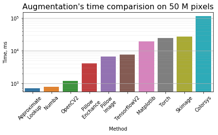
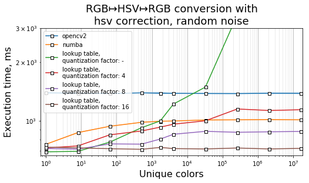
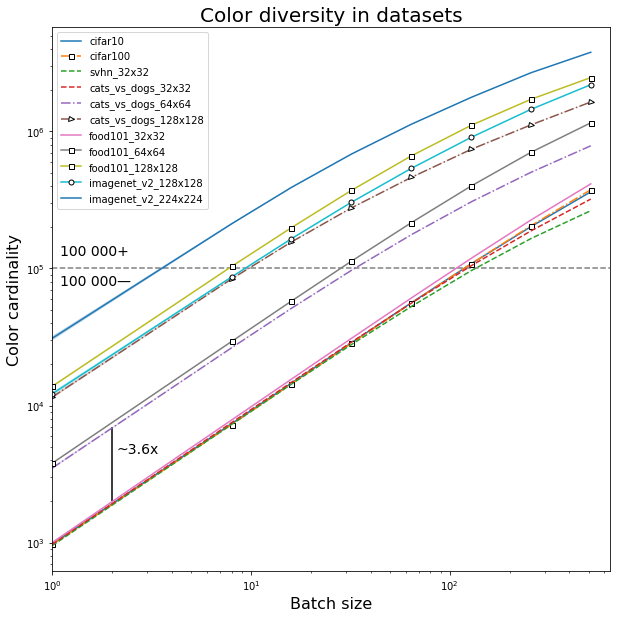
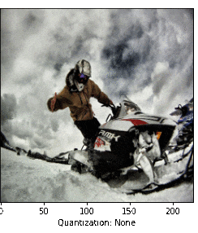
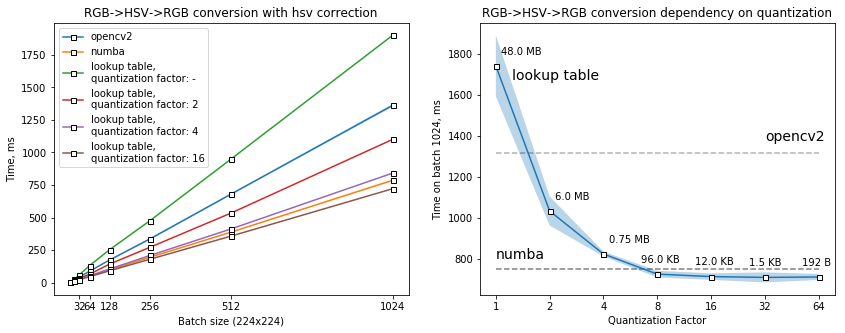

# approximate-rgb-to-hsv
Process over 50 M pixels under a second on CPU, Numba, Python, 2021

      

Augmentations applied include hue, saturation, brightness and contrast correction.

Reported results were obtained on ImageNetV2 images.

Reported results were obtained using the following specs on Google Colab:

|Parameter| Value|
|:--------------|---:|
|CPU|Intel(R) Xeon(R) CPU @ 2.30GHz|
|Socket(s):           |1|
|Core(s) per socket:  |2|
|Thread(s) per core:  |2|
|L1 cache:            |8K|
|L2 cache:            |512K|
|L3 cache:            |46080K|
|RAM:             |12GB|

For benchmark we used 224x224 images with batch size of 1024.

Numba implementation achieves ~800 ms, while approximate version results in ~710 ms,
which is 11% faster.

# RGB ↦ HSV

r,g,b ∈ [0, 255] ↦ h ∈ [0, 1)

r,g,b ∈ [0, 255] ↦ s ∈ [0, 1)

r,g,b ∈ [0, 255] ↦ v ∈ [0, 255]

However, 83.27% of hue values are located in range [0, 0.8327] ([0, 212] in uint8)

Other 16.63% of values are located in negative range [-0.1663, 0) ( [214, 255] in uint8)

Due to the fact, that hue is a periodic function:

h(x)=h(x+1)=h(x-1)

negative range is usually converted to it's positive values like this:

[-0.1663, 0) -(+1)> [0.8327, 1)

Thus, this transformation can be ignored if working with discrete codes (unsigned 8bit int overflow will automatically map values to a desired range)

# HSV ↦ RGB

h ∈ (-∞, +∞) ↦ r,g,b ∈ [0, 255]

s ∈ [0, 1) ↦ r,g,b ∈ [0, 255]

v ∈ [0, 255] ↦ r,g,b ∈ [0, 255]

Reverse conversion takes into account negative values for hue and values greater than 1. 

# Speed pitfalls

The main algorithm has several conditional branches, which on natural images will be fast due to the 1-bit or 2-bit predictors: [__info__](https://en.wikipedia.org/wiki/Branch_predictor)

Also, CPU's L1 and L2 are much smaller than all possible combinations of colors (256x256x256x3 = 48 MB).
Because of that when the number of colors in provided data increases, algorithms will work slower:

      

Here is the dependency of color diversity in various image classification datasets from the batch size:

      

To leverage the problem of CPU's cache misses we use lookup tables with color quantization:

      

      

Thus, an optimal value of 16 was chosen for benchmarks. 

Such lookup table take around 12 KB of memmory, which can be succesfully placed in L2 cache and partly in L1 cache.

